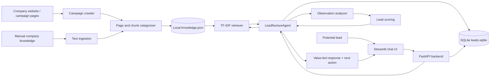
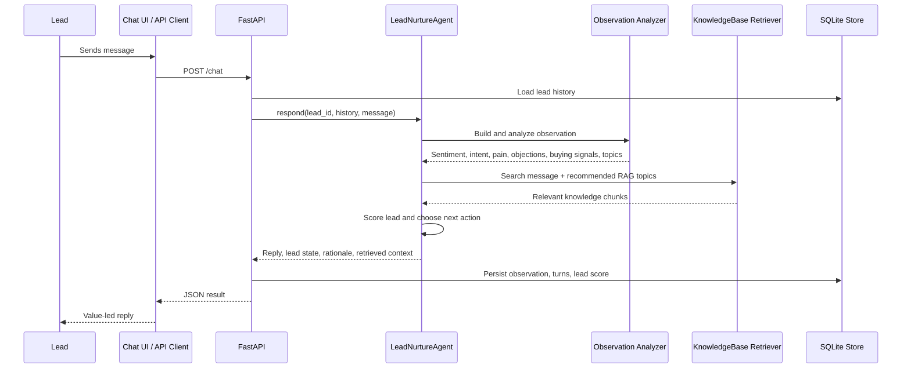
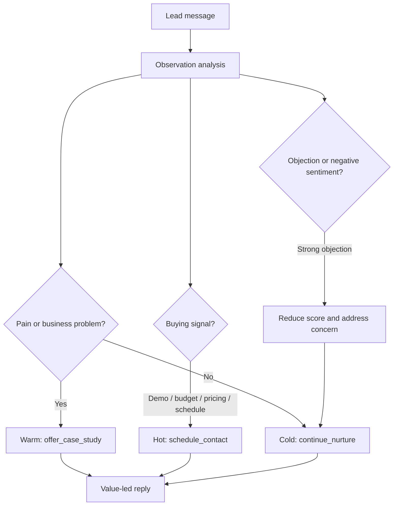

# Lead Nurture RAG Bot

A prototype chatbot for testing a RAG-backed lead generation and nurturing loop before integrating the same logic into email, CRM, or outbound campaign tooling.

The project is intentionally small and local-first: it uses FastAPI, Streamlit, SQLite, and a TF-IDF retrieval store so you can test the agent loop without standing up vector databases or paid LLM infrastructure. If `OPENAI_API_KEY` is present, the bot can use an LLM for responses. If not, it falls back to deterministic local response generation.

## What this prototype does

- Ingests company, website, product, or offer knowledge into a local RAG-style knowledge base.
- Crawls campaign websites from configured seed pages with domain limits and page filtering.
- Categorizes pages and chunks with metadata such as persona, industry, intent stage, topics, and questions answered.
- Runs a lead-nurturing conversation loop through a chat bot interface.
- Treats every inbound message as an observation.
- Extracts sentiment, intent, pain points, objections, buying signals, questions, recommended retrieval topics, and explicitly self-disclosed demographics.
- Retrieves relevant company knowledge for each turn.
- Scores the lead as `cold`, `warm`, or `hot`.
- Chooses a next-best action: `continue_nurture`, `offer_case_study`, or `schedule_contact`.
- Persists conversation turns, lead state, and observation analysis in SQLite.
- Exposes a FastAPI backend and a Streamlit testing UI.

## Repository layout

```text
.
├── README.md
├── campaigns/
│   └── example.json
├── docs/
│   ├── README.md
│   ├── architecture.md
│   ├── data-flow.md
│   ├── getting-started.md
│   ├── api.md
│   ├── campaign-ingestion.md
│   ├── lead-scoring-and-observations.md
│   ├── email-integration-roadmap.md
│   └── development.md
├── scripts/
│   └── ingest_campaign.py
├── src/lead_nurture_rag/
│   ├── agent.py
│   ├── app.py
│   ├── categorizer.py
│   ├── crawler.py
│   ├── models.py
│   ├── observation.py
│   ├── retriever.py
│   ├── store.py
│   └── web.py
└── tests/
```

## High-level architecture



## Agent loop



## Quick start

### 1. Clone and install

```bash
git clone git@github.com:carygeo/lead-nurture-rag-bot.git
cd lead-nurture-rag-bot
uv sync --extra test
cp .env.example .env
```

### 2. Start the API

```bash
uv run uvicorn lead_nurture_rag.app:app --reload
```

Check health:

```bash
curl http://localhost:8000/health
```

Expected shape:

```json
{
  "ok": true,
  "chunks": 0
}
```

### 3. Start the chat UI

In a second terminal:

```bash
uv run streamlit run src/lead_nurture_rag/web.py
```

Open the Streamlit URL, add company knowledge in the sidebar, and chat as a potential lead.

## Optional LLM mode

The system runs without an LLM key. In that mode it uses deterministic fallback responses so you can test the retrieval, scoring, observation, and persistence loop.

To enable LLM-written responses, set:

```bash
OPENAI_API_KEY=sk-...
OPENAI_MODEL=gpt-4o-mini
```

Do not commit `.env`.

## Ingest knowledge

### Ingest text

```bash
curl -X POST http://localhost:8000/ingest/text \
  -H 'Content-Type: application/json' \
  -d '{
    "source": "company-profile",
    "text": "BuildCo AI validates subcontractor payment applications, finds missing lien waivers, and summarizes risk before approvals."
  }'
```

### Crawl a campaign website

Edit `campaigns/example.json`, then run either:

```bash
curl -X POST http://localhost:8000/ingest/campaign \
  -H 'Content-Type: application/json' \
  -d @campaigns/example.json
```

or:

```bash
uv run python scripts/ingest_campaign.py campaigns/example.json
```

The crawler starts from `seed_pages`, only follows links on `allowed_domains`, skips noisy pages such as privacy/terms/login/careers, extracts main page text, categorizes each page/chunk, and stores stable chunks in `data/knowledge.json`.

Each chunk receives metadata similar to:

```json
{
  "company_name": "Example Construction AI",
  "page_type": "solution",
  "intent_stage": "consideration",
  "topics": ["payment_application_validation", "risk_reduction"],
  "personas": ["project_team"],
  "industries": ["construction"],
  "questions_answered": ["pain_point"]
}
```

This metadata is included in the retrieval index, so lead questions such as “Can this reduce lien waiver risk?” can match both page text and conceptual tags.

## Chat API example

```bash
curl -X POST http://localhost:8000/chat \
  -H 'Content-Type: application/json' \
  -d '{
    "lead_id": "demo-lead",
    "message": "We spend too much time checking payment apps. Can this reduce missing lien waivers?"
  }'
```

Response shape:

```json
{
  "lead": {
    "lead_id": "demo-lead",
    "temperature": "warm",
    "score": 64,
    "signals": ["reduce", "too much time", "missing"],
    "objections": [],
    "demographics": {}
  },
  "reply": "That pain is exactly where the strongest value tends to show up...",
  "retrieved_context": [],
  "next_action": "offer_case_study",
  "observation": {
    "sentiment": {"label": "positive", "score": 0.3, "evidence": ["reduce"]},
    "intent": "learn",
    "pain_points": ["too much time", "missing"],
    "objections": [],
    "buying_signals": [],
    "questions": ["We spend too much time checking payment apps. Can this reduce missing lien waivers?"],
    "recommended_rag_topics": ["risk_reduction"]
  },
  "rationale": "warm lead scored ..."
}
```

Exact scores vary as the scoring logic changes.

## Lead temperature logic

- `cold`: weak or generic engagement. Continue nurture with a light value point and one focused qualification question.
- `warm`: clear pain, interest, or business-specific question. Offer a case study, workflow example, or proof point.
- `hot`: demo, budget, schedule, pricing, proposal, or purchase timing signal. Ask for a concrete appointment/demo window.



## Observation and demographic handling

The observation analyzer records what the lead actually says and avoids guessing sensitive traits.

It may extract:

- Sentiment and evidence.
- Intent such as `learn`, `evaluate`, `object`, `schedule_demo`, or `disengage`.
- Pain points.
- Objections.
- Buying signals.
- Questions.
- Recommended RAG topics.
- Business-relevant role or industry when explicitly stated.
- Age range and gender only when explicitly self-disclosed.

It does **not** infer protected traits from name, writing style, role, or email address.

Inspect observations:

```bash
curl http://localhost:8000/leads/demo-lead/observations
```

List leads:

```bash
curl http://localhost:8000/leads
```

## Data persistence

Local runtime data is stored under `data/` by default:

```text
data/
├── knowledge.json   # persisted RAG chunks and metadata
└── leads.sqlite     # turns, observations, lead scores
```

Override the data location with:

```bash
DATA_DIR=/path/to/data uv run uvicorn lead_nurture_rag.app:app --reload
```

`data/` is ignored by git.

## Documentation

Detailed docs are in [`docs/`](docs/README.md):

- [Getting started](docs/getting-started.md)
- [Architecture](docs/architecture.md)
- [Data flow](docs/data-flow.md)
- [Data flow details](docs/data-flow-details.md)
- [API reference](docs/api.md)
- [Campaign ingestion](docs/campaign-ingestion.md)
- [Lead scoring and observations](docs/lead-scoring-and-observations.md)
- [Email integration roadmap](docs/email-integration-roadmap.md)
- [Development](docs/development.md)

## Development

Run tests:

```bash
uv run python -m pytest -q
```

Run the API locally:

```bash
uv run uvicorn lead_nurture_rag.app:app --reload
```

Run the UI locally:

```bash
uv run streamlit run src/lead_nurture_rag/web.py
```

## Next integration steps

1. Replace local TF-IDF retrieval with Chroma, Qdrant, pgvector, or managed embeddings.
2. Add campaign/persona prompt profiles for different outbound motions.
3. Add an email adapter that maps inbound replies to `LeadNurtureAgent.respond()`.
4. Add a human-review queue for hot leads before sending sales follow-up.
5. Add CRM export for leads, observations, and next actions.
6. Add richer analytics around lead progression over time.
