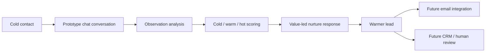

# Documentation

This folder contains the detailed design and operating docs for the Lead Nurture RAG Bot prototype.

## Contents

- [Getting started](getting-started.md) — install, run the API, run the Streamlit UI, and test the loop.
- [Architecture](architecture.md) — components, responsibilities, and extension points.
- [Data flow](data-flow.md) — Mermaid diagrams for ingestion, chat, observation, persistence, and future email flow.
- [Data flow details](data-flow-details.md) — endpoint/service/storage connection map.
- [API reference](api.md) — endpoint examples and response shapes.
- [Campaign ingestion](campaign-ingestion.md) — how website crawling and categorization work.
- [Lead scoring and observations](lead-scoring-and-observations.md) — how messages become scored observations.
- [Email integration roadmap](email-integration-roadmap.md) — how to reuse the chat prototype for async email nurturing.
- [Teammate repo comparison: rag-b2b-crm](teammate-repo-comparison-rag-b2b-crm.md) — how this prototype compares to and can extend the broader CRM repo.
- [Development](development.md) — tests, local development, and contribution notes.

## Prototype goal

The goal is to validate lead nurturing logic before wiring it into email or CRM systems:

