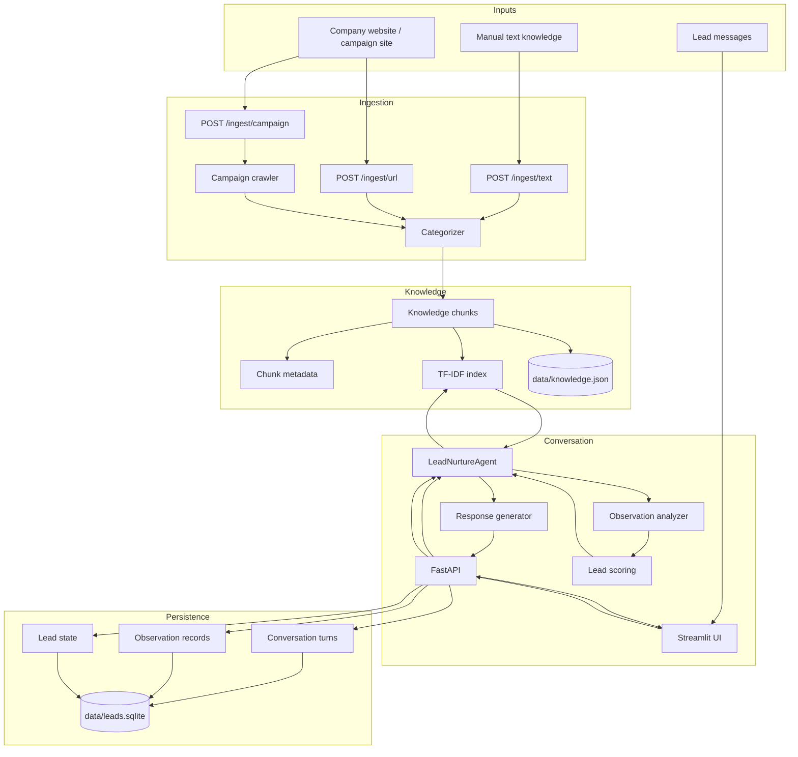
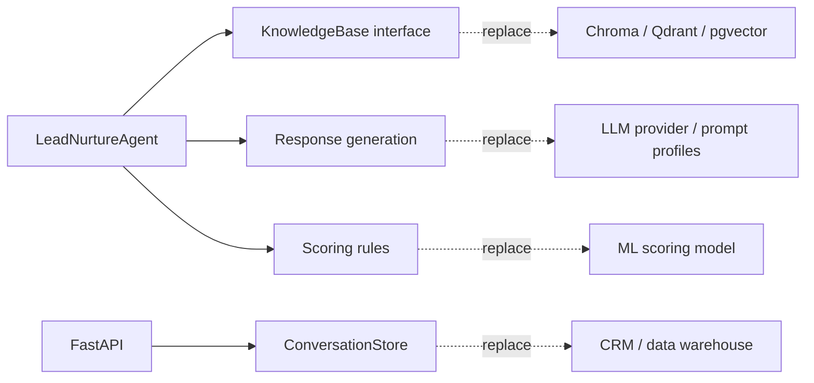

# Architecture

The prototype separates ingestion, retrieval, observation analysis, lead scoring, response generation, and persistence so each part can be replaced independently later.

## Component diagram

## Main modules

### `app.py`

FastAPI entry point. It wires together:

- `KnowledgeBase(DATA_DIR / "knowledge.json")`
- `ConversationStore(DATA_DIR / "leads.sqlite")`
- `LeadNurtureAgent(kb)`

It exposes ingestion, chat, lead listing, and observation endpoints.

### `retriever.py`

Small local knowledge base. It:

- normalizes text,
- splits text into stable overlapping chunks,
- assigns stable chunk IDs,
- categorizes chunks,
- persists chunks to JSON,
- indexes chunk text plus metadata with `TfidfVectorizer`,
- returns `SearchHit` records with relevance scores.

This is intentionally simple. The public shape is close enough that it can later be swapped for Chroma, Qdrant, pgvector, or a managed embedding service.

### `crawler.py`

Campaign-oriented crawler. It:

- accepts `CampaignConfig`,
- starts from seed pages,
- limits crawling to allowed domains,
- skips noisy pages,
- extracts main body text,
- categorizes pages,
- returns `CrawledDocument` objects for ingestion.

### `categorizer.py`

Metadata enrichment. It identifies page and chunk attributes such as:

- page type,
- intent stage,
- topics,
- personas,
- industries,
- questions answered.

Metadata is included in the retrieval index so conceptual searches can match even when exact wording differs.

### `observation.py`

Turns a lead message into a structured observation analysis:

- sentiment,
- intent,
- pain points,
- objections,
- buying signals,
- questions,
- recommended RAG topics,
- explicitly self-disclosed demographics.

The demographic policy is conservative: age range and gender are recorded only when explicitly self-disclosed. The system does not guess protected traits.

### `agent.py`

The core loop:

1. Build and analyze observation.
2. Expand the retrieval query with recommended RAG topics.
3. Retrieve relevant company knowledge.
4. Score the lead.
5. Choose the next action.
6. Generate either an LLM reply or deterministic fallback reply.
7. Return a complete `AgentTurnResult`.

### `store.py`

SQLite persistence for:

- conversation turns,
- current lead state,
- observation analysis records.

## Replaceable seams

The goal is not to make the first version production-grade. The goal is to validate the conversation logic, lead-state transitions, and knowledge-grounded response strategy before adding email and CRM integrations.
