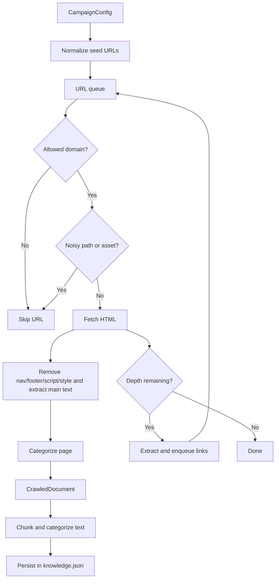
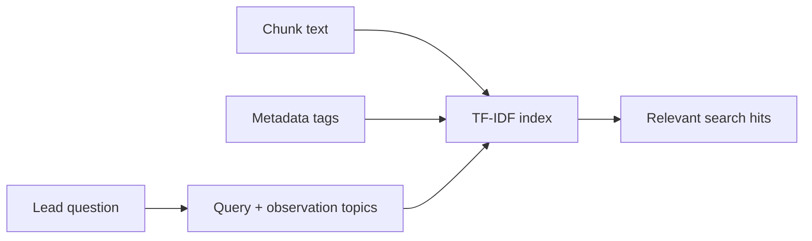

# Campaign ingestion

Campaign ingestion lets you seed the knowledge base from a company or campaign website instead of manually pasting text.

## Campaign config

Campaigns are configured with `CampaignConfig` from `crawler.py`.

Example: `campaigns/example.json`

```json
{
  "company_name": "Example Construction AI",
  "root_url": "https://example.com",
  "allowed_domains": ["example.com"],
  "seed_pages": ["https://example.com", "https://example.com/solutions"],
  "crawl_depth": 1,
  "max_pages": 10,
  "target_persona": "construction project teams",
  "offer": "AI payment application validation"
}
```

Fields:

- `company_name`: name added to chunk metadata.
- `root_url`: canonical company or campaign root.
- `allowed_domains`: domains the crawler is allowed to follow.
- `seed_pages`: starting URLs. If omitted, the crawler starts from `root_url`.
- `crawl_depth`: link-following depth from seed pages.
- `max_pages`: maximum pages to ingest.
- `target_persona`: optional campaign persona metadata.
- `offer`: optional offer metadata.

## Crawl flow



## Noise filtering

The crawler skips paths containing common low-value or risky pages:

- privacy
- terms
- cookie
- login / signin / signup
- careers / jobs
- cart / checkout
- WordPress tag/category/author paths
- common media/archive file extensions

This keeps the knowledge base focused on pages likely to contain sales, product, proof, FAQ, and buyer-relevant content.

## Categorization

After extraction, pages and chunks are tagged with metadata. The exact values are rule-based in the prototype. Typical metadata includes:

```json
{
  "company_name": "Example Construction AI",
  "page_title": "Solutions",
  "page_type": "solution",
  "intent_stage": "consideration",
  "topics": ["payment_application_validation", "risk_reduction"],
  "personas": ["project_team"],
  "industries": ["construction"],
  "questions_answered": ["pain_point"]
}
```

## Why metadata matters

The retriever indexes both the chunk text and metadata text:



This means a lead can ask a conceptually related question even if the exact words are not present in the source page.

Example:

```text
Can this help reduce lien waiver risk?
```

may match chunks tagged with:

```json
{
  "topics": ["risk_reduction", "payment_application_validation"]
}
```

## Command-line ingestion

You can ingest a campaign without starting the API:

```bash
uv run python scripts/ingest_campaign.py campaigns/example.json
```

Use this when building or refreshing a local knowledge base before a demo.

## Practical guidance

For early tests, prefer narrow campaign configs:

- use 3–10 high-value seed pages,
- keep `crawl_depth` at `1`,
- avoid broad blog archives,
- include pricing, FAQ, solution, case study, and product pages if available,
- set `target_persona` and `offer` so chunks carry campaign context.
