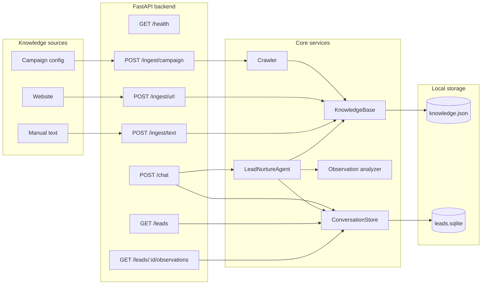

# Data flow details

This document supplements the architecture docs with a connection-oriented view of the system.

## End-to-end connections

## Runtime request/response boundary

The `POST /chat` response intentionally returns more than just the reply. This makes the prototype debuggable.

Returned data includes:

- the generated reply,
- the current lead state,
- retrieved context,
- structured observation analysis,
- next action,
- scoring rationale.

That makes it possible to inspect why a lead became warm or hot instead of treating the bot as a black box.
