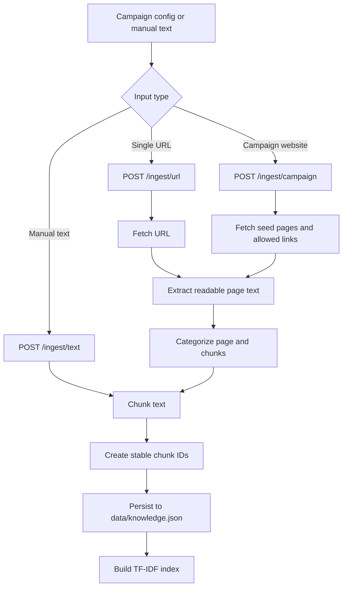
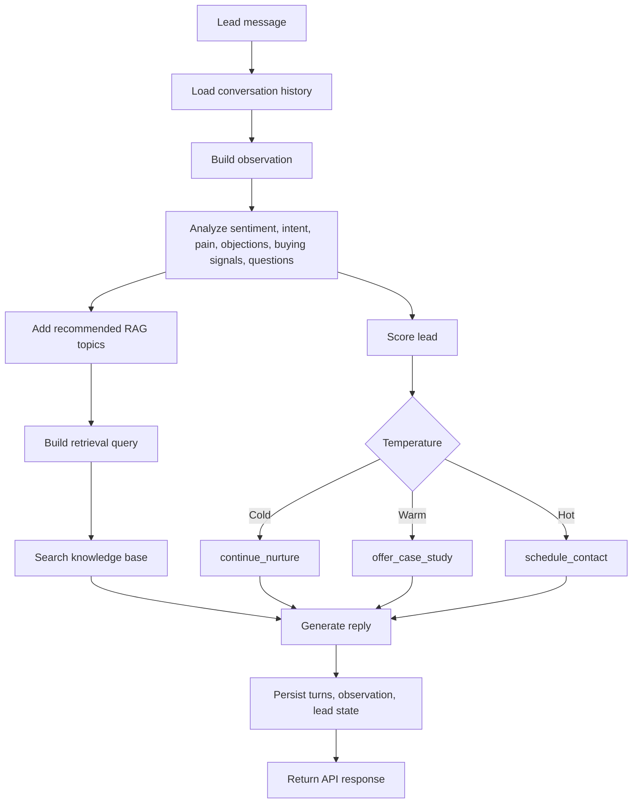
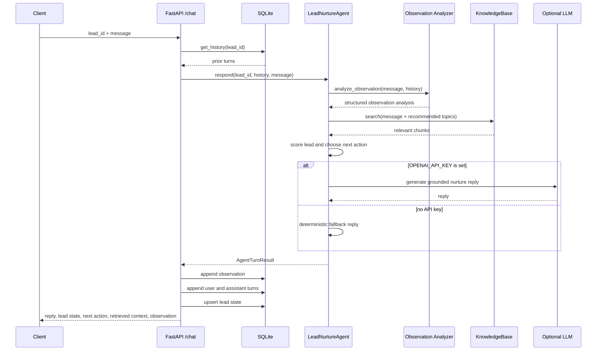
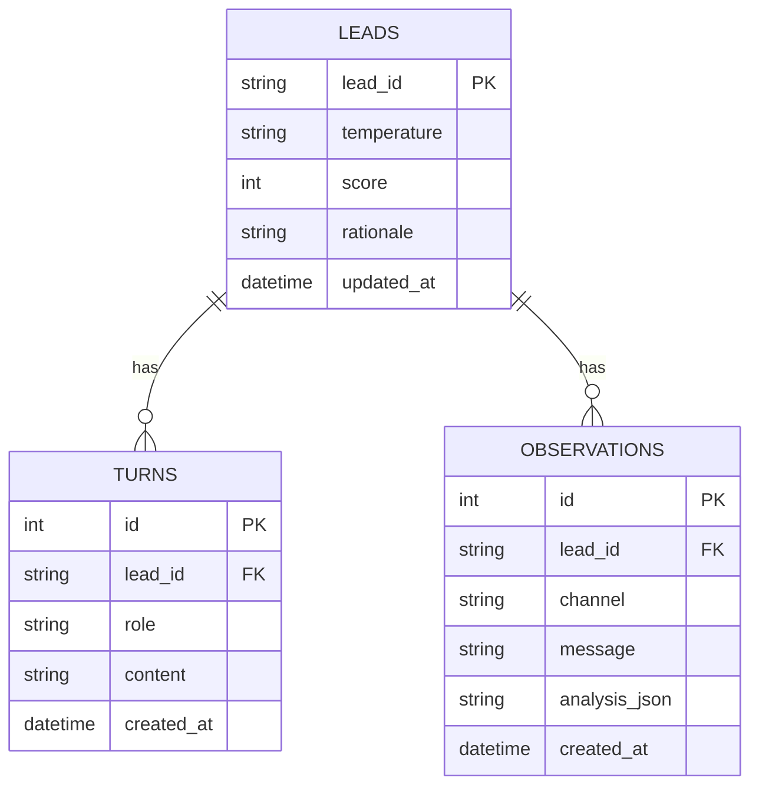
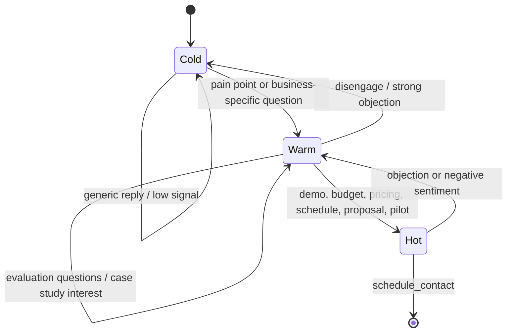
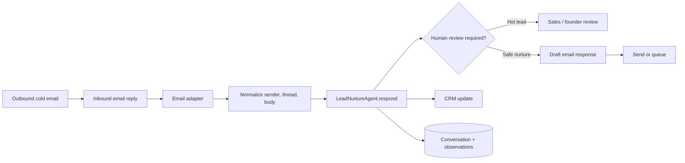

# Data flow

This page documents how data moves through the prototype.

## Knowledge ingestion flow

## Chat turn flow

## Sequence: one chat request

## Persistence model

## Lead warming flow

## Future email data flow

