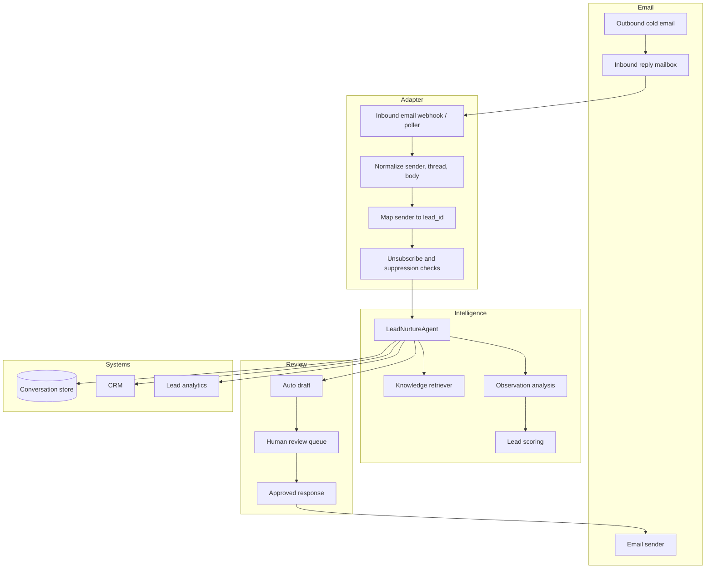
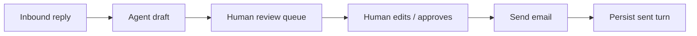
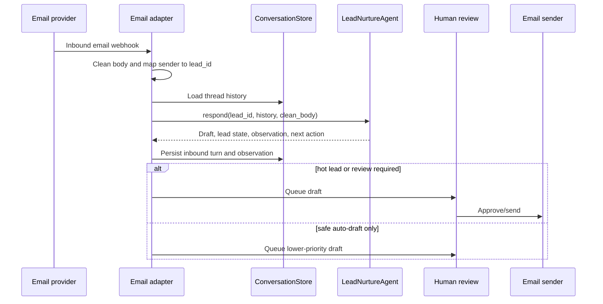

# Email integration roadmap

The chat bot is the prototype surface. The longer-term goal is to reuse the same RAG, observation, scoring, and nurturing loop for email conversations.

## Why start with chat

Chat is easier to test because:

- one user message maps cleanly to one agent turn,
- latency is acceptable,
- you can see the full JSON result immediately,
- you can quickly simulate cold, warm, and hot lead behavior,
- you do not need deliverability, unsubscribe, mailbox, or CRM infrastructure to validate the logic.

## Future email architecture



## Reusing the current agent loop

The email adapter should transform an inbound email into the same inputs that `/chat` uses:

```python
result = agent.respond(
    lead_id=lead_id,
    history=store.get_history(lead_id),
    message=clean_email_body,
)
```

Then persist the same outputs:

- user turn = inbound email body,
- assistant turn = drafted/sent email body,
- observation analysis,
- lead score and temperature,
- next action.

## Email-specific additions

Before sending real email, add these layers.

### Identity and threading

Map email metadata to lead records:

- sender email,
- domain,
- original campaign,
- thread ID,
- message ID,
- CRM/contact ID if available.

### Compliance and safety

Handle:

- unsubscribe requests,
- suppression lists,
- bounces,
- out-of-office replies,
- spam complaints,
- opt-out language,
- human-review gates for hot leads or ambiguous replies.

### Draft-before-send mode

Recommended first email version:



This avoids accidentally sending poor or noncompliant outreach while validating the system.

### Campaign and persona profiles

Add a campaign layer that controls:

- target persona,
- offer,
- tone,
- qualification questions,
- proof assets,
- disallowed claims,
- escalation criteria.

Example future profile:

```json
{
  "campaign_id": "construction-pay-app-validation",
  "target_persona": "construction CFO / project executive",
  "offer": "AI payment application validation workflow review",
  "primary_value_props": [
    "reduce manual payment application review time",
    "catch missing lien waivers earlier",
    "summarize approval risk before payment"
  ],
  "hot_lead_triggers": ["demo", "budget", "pricing", "pilot", "schedule"],
  "human_review_required": true
}
```

## Suggested implementation phases

### Phase 1: chat prototype

Already represented by this repo:

- local knowledge ingestion,
- chat UI,
- RAG retrieval,
- observation analysis,
- lead scoring,
- persistence.

### Phase 2: email draft prototype

Add:

- inbound email import script,
- `email_thread_id` support,
- draft output endpoint,
- no automatic sends,
- human-review queue.

### Phase 3: controlled sending

Add:

- approved sends only,
- unsubscribe handling,
- suppression list,
- bounce handling,
- CRM update/export.

### Phase 4: optimization

Add:

- vector search,
- richer campaign profiles,
- analytics on lead progression,
- A/B tests for value propositions,
- prompt evaluation against saved conversation fixtures.

## Minimal future adapter shape


