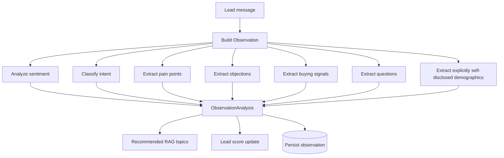
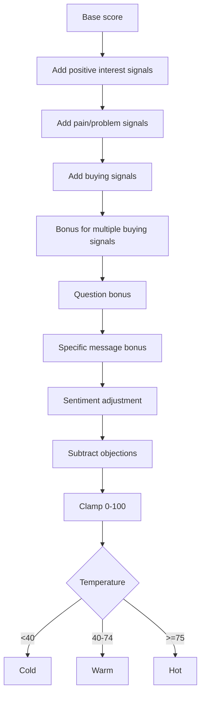
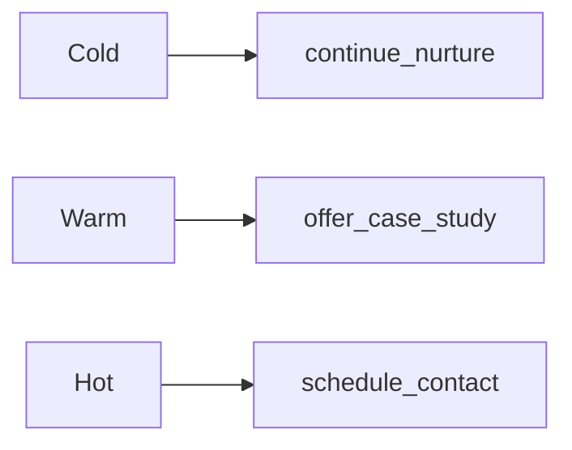
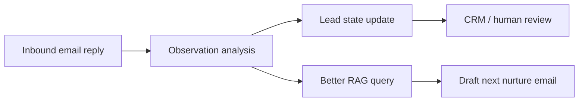

# Lead scoring and observations

The prototype is built around the idea that each inbound message is an observation about the lead.

The observation is then used to:

- improve retrieval,
- update the lead score,
- choose a next-best action,
- persist structured intelligence for later email/CRM workflows.

## Observation flow



## Observation fields

A typical observation analysis includes:

```json
{
  "sentiment": {
    "label": "positive",
    "score": 0.6,
    "evidence": ["useful", "budget", "demo"]
  },
  "intent": "schedule_demo",
  "pain_points": ["too much time"],
  "objections": [],
  "buying_signals": ["budget", "demo"],
  "questions": ["Can this reduce missing lien waivers?"],
  "recommended_rag_topics": ["risk_reduction", "payment_application_validation"],
  "demographics": {
    "occupation": "CFO",
    "industry": "construction",
    "inference_policy": "explicit_self_disclosure_only"
  }
}
```

## Intent classes

Current intent labels:

- `learn`: the lead is asking an educational or exploratory question.
- `evaluate`: the lead is comparing fit, workflow, implementation, or proof.
- `object`: the lead has a concern or pushback.
- `schedule_demo`: the lead shows contact, demo, budget, pricing, proposal, or scheduling intent.
- `disengage`: the lead asks to stop or indicates no interest.

## Lead scoring

The current scoring is a rule-based prototype. It starts with a low base score and adjusts for:

- positive or interest-oriented terms,
- pain terms,
- buying signals,
- multiple buying signals,
- questions,
- message specificity / length,
- positive or negative sentiment,
- schedule-demo intent,
- objections.

Scores are clamped between 0 and 100.



## Temperature thresholds

- `cold`: score below 40.
- `warm`: score from 40 through 74.
- `hot`: score 75 or above.

## Next action mapping



### `continue_nurture`

Use when the lead is still cold or vague.

Response strategy:

- lead with a light value point,
- avoid pressure,
- ask one focused qualification question.

### `offer_case_study`

Use when the lead is warm.

Response strategy:

- connect their pain to a specific business value,
- offer an example, workflow, or case-study-style proof point,
- ask what part of the workflow is most painful.

### `schedule_contact`

Use when the lead is hot.

Response strategy:

- acknowledge active fit,
- propose a short contact appointment or demo,
- ask for a concrete time window.

## Demographic policy

The prototype deliberately avoids guessing sensitive traits.

It may record age range or gender only when the lead explicitly self-discloses them.

Example that can be recorded:

```text
I am a 42-year-old woman and the CFO for a construction firm.
```

Example output:

```json
{
  "age_range": "40s",
  "gender": "woman",
  "occupation": "CFO",
  "industry": "construction",
  "inference_policy": "explicit_self_disclosure_only"
}
```

Example that should not infer age or gender:

```text
I manage pay apps for our construction team.
```

Allowed output:

```json
{
  "age_range": null,
  "gender": null,
  "occupation": "project_team",
  "industry": "construction",
  "inference_policy": "explicit_self_disclosure_only"
}
```

The system does not infer protected traits from:

- name,
- writing style,
- email address,
- perceived tone,
- job title alone.

## Why observations matter for email later

In an email setting, each inbound email reply can become the same kind of observation:



This lets the chat prototype validate the core intelligence layer before adding email delivery, unsubscribe handling, deliverability, and CRM workflows.
