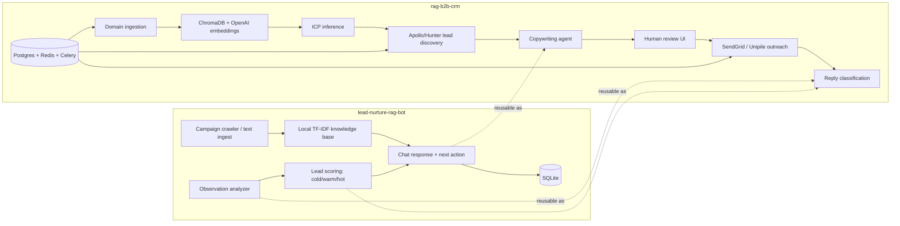
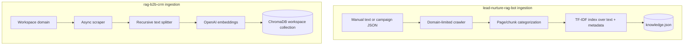
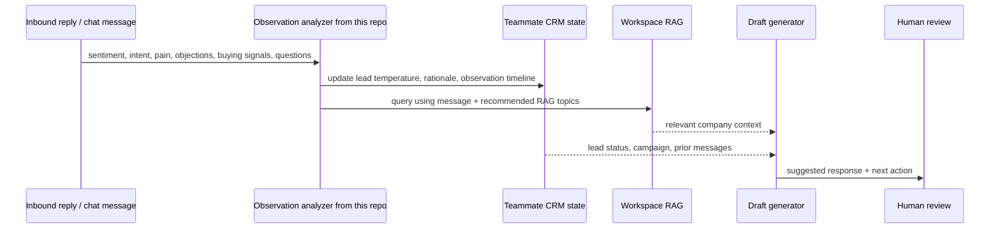

# Comparison: `lead-nurture-rag-bot` and `cbcampb25/rag-b2b-crm`

Comparison date: 2026-06-24  
Our repo: [`carygeo/lead-nurture-rag-bot`](https://github.com/carygeo/lead-nurture-rag-bot) at `12603e5`  
Teammate repo: [`cbcampb25/rag-b2b-crm`](https://github.com/cbcampb25/rag-b2b-crm) at `33f480d`

## Executive summary

The two repos are aimed at the same broad product direction — RAG-assisted B2B lead generation and nurturing — but they sit at different layers of the stack.

`lead-nurture-rag-bot` is a small, testable prototype focused on the **conversation intelligence loop**:

```text
company knowledge → retrieval → observation analysis → cold/warm/hot scoring → next-best response
```

`rag-b2b-crm` is a larger application scaffold focused on the **end-to-end GTM/CRM workflow**:

```text
website ingestion → ICP inference → lead discovery → campaign copy → human review → outreach → reply handling
```

The strongest integration path is to treat this repo's observation/scoring/chat loop as a proven **nurture intelligence engine**, and plug it into the teammate repo's broader CRM/orchestration surface.

## Product scope comparison

- `lead-nurture-rag-bot`
  - Best for testing message-by-message nurture logic.
  - Has a working chat loop and deterministic fallback mode.
  - Persists lead observations and lead temperature locally.
  - Does not yet do real lead sourcing, outbound sending, campaign management, or CRM UI.

- `rag-b2b-crm`
  - Best for building a full lead generation and outreach product.
  - Has a Next.js frontend, FastAPI backend, Celery workers, Redis, PostgreSQL/pgvector-oriented models, ChromaDB, SendGrid, Unipile, Apollo, and Hunter integration points.
  - Has route/task scaffolding for ingestion, ICP inference, lead discovery, campaign copy, outreach, review, and reply webhook handling.
  - Has much less automated test coverage and a thinner README at the inspected commit.

## Architecture comparison



## Capability matrix

| Capability | `lead-nurture-rag-bot` | `rag-b2b-crm` | Notes |
|---|---|---|---|
| Local quick start | Strong | Moderate | This repo runs with `uv`, SQLite, and no external services. Teammate repo expects Postgres, Redis, backend, frontend, workers, and API keys. |
| Website/domain ingestion | Present | Present | This repo has campaign configs, domain limits, chunk metadata, and a recent fix for metadata-only JS landing pages. Teammate repo scrapes domains and stores chunks in ChromaDB. |
| RAG retrieval | Local TF-IDF | ChromaDB + OpenAI embeddings | This repo is simpler and cheaper; teammate repo is closer to production retrieval. |
| ICP inference | Not present | Present | Teammate repo has an ICP agent that prompts GPT-4o over RAG context. |
| Lead discovery | Not present | Present scaffold | Teammate repo integrates Apollo and Hunter search helpers. |
| Conversation observation analysis | Strong | Limited | This repo extracts sentiment, intent, pain, objections, buying signals, questions, RAG topics, and conservative demographics. Teammate repo classifies email replies into coarse categories. |
| Lead temperature scoring | Strong | Different model | This repo scores `cold`, `warm`, `hot`. Teammate repo models lead pipeline statuses and `icp_score`. |
| Response generation | Chat nurture reply | Outreach copy + reply draft | This repo optimizes the next conversational turn. Teammate repo generates outbound copy and drafts responses to replies. |
| Human review | Not present | Present scaffold | Teammate repo has review routes and UI, though DB wiring is marked TODO in route comments. |
| Email/LinkedIn sending | Not present | Present scaffold | Teammate repo has SendGrid and Unipile send helpers. |
| Frontend | Streamlit test UI | Next.js app | This repo's UI is for rapid prototype testing. Teammate repo has dashboard/onboard/leads/campaign/review/inbox surfaces. |
| Persistence | SQLite + JSON | Postgres models + Chroma + Redis | Teammate repo has production-shaped infrastructure; this repo is intentionally local-first. |
| Background jobs | Not needed | Celery + Redis | Teammate repo uses async tasks for ingestion, lead discovery, copy generation, nurture, and outreach. |
| Tests | Strong for prototype | Sparse/none visible | This repo has 17 passing tests. No test files were present in teammate repo at inspection time. |
| Documentation | Comprehensive docs folder | Minimal README + AGENTS guide | This repo has detailed setup/API/architecture/docs. Teammate repo has a brief README but a useful `AGENTS.md` project guide. |

## Data model comparison

### This repo

This repo persists three core entities in SQLite:

- `turns`: user/assistant conversation turns.
- `leads`: current `temperature`, score, and rationale.
- `observations`: structured analysis JSON for each inbound message.

It also persists RAG chunks in `data/knowledge.json`.

### Teammate repo

The teammate repo has SQLAlchemy models for a fuller CRM-style domain:

- `Lead`: person/company fields, ICP score, source, and pipeline status.
- `Campaign`: channel, approval state, sequence settings, and stats.
- `CampaignMessage`: per-lead outreach message, status, human edits, provider message ID, timestamps, and metadata.
- Workspace models are also present and referenced by foreign keys.

This makes the teammate repo a better home for production CRM state, while this repo's observation records are a missing piece that could enrich that CRM state.

## Retrieval and ingestion comparison



Key difference:

- This repo emphasizes **inspectability and campaign-specific metadata**.
- The teammate repo emphasizes **embedding-based retrieval and workspace separation**.

Recommended merge direction:

1. Keep teammate repo's ChromaDB/workspace approach.
2. Port this repo's crawler metadata extraction and categorization ideas.
3. Add this repo's observation-generated `recommended_rag_topics` to teammate repo's reply/context queries.

## Nurture/reply intelligence comparison



The teammate repo currently has `classify_reply()` with categories:

- `interested`
- `not_interested`
- `out_of_office`
- `needs_more_info`
- `referral`

This repo's observation analyzer is more detailed and can provide a richer signal set:

- sentiment label and score,
- intent,
- pain points,
- objections,
- buying signals,
- questions,
- recommended RAG topics,
- conservative demographics policy.

Those fields would make the teammate repo's inbox/reply handling more actionable than a single classification label.

## Suggested integration plan

### Phase 1: Align concepts and schemas

Add an `Observation` concept to `rag-b2b-crm`.

Suggested fields:

- `lead_id`
- `campaign_message_id`
- `channel`
- `message`
- `sentiment_label`
- `sentiment_score`
- `intent`
- `pain_points` JSON
- `objections` JSON
- `buying_signals` JSON
- `questions` JSON
- `recommended_rag_topics` JSON
- `lead_temperature`
- `lead_score`
- `rationale`
- `created_at`

### Phase 2: Port observation analysis

Move/adapt from this repo:

- `src/lead_nurture_rag/observation.py`
- `score_lead()` from `agent.py`
- tests from:
  - `tests/test_observation_analysis.py`
  - `tests/test_agent_observation.py`
  - `tests/test_store_observations.py`

In `rag-b2b-crm`, wire this into:

- `backend/app/agents/nurture_agent.py`
- `backend/app/tasks/nurture_tasks.py`
- `backend/app/api/routes/outreach.py` reply webhook

### Phase 3: Preserve human review

Do not auto-send new nurture responses initially.

Use teammate repo's review surface as the control point:

```text
reply webhook → observation + lead score → draft response → review queue → approve/send
```

This keeps the production workflow safer than direct autonomous sending.

### Phase 4: Replace prototype persistence with CRM persistence

Keep this repo's SQLite store for local testing, but in the teammate repo persist to Postgres models.

Likely additions:

- `lead_observations` table,
- `lead_temperature` or `temperature` field on `Lead`,
- `latest_observation_summary` or rationale field,
- indexes on `lead_id`, `campaign_message_id`, and `created_at`.

### Phase 5: Use teammate repo's RAG backend

Once the observation loop is ported, use teammate repo's ChromaDB retrieval rather than this repo's TF-IDF store.

Query shape:

```text
lead reply + pain points + questions + recommended_rag_topics + campaign context
```

This should improve answer grounding for reply drafts.

## Gaps and risks to resolve

### In this repo

- No CRM-grade lead/contact/campaign model.
- No real outbound email/LinkedIn sending.
- No background workers.
- No production auth or multi-user workspace model.
- TF-IDF retrieval is intentionally simple and should eventually be replaced.

### In teammate repo

- Minimal public-facing README at inspected commit.
- No tests were visible in the checkout.
- Review routes currently include TODO comments for DB wiring.
- Lead discovery/copy flow depends on external providers and API keys.
- Reply handling classifies responses but does not yet appear to maintain a detailed observation timeline or cold/warm/hot lead temperature loop.
- The ingestion scraper may hit the same JS-rendered-site issue this repo just fixed for Supernews unless metadata/JS rendering support is added.

## Practical near-term recommendation

Use this repo to keep iterating on the intelligence loop quickly:

```text
message → observation → retrieval topics → score → next action → response
```

Use `rag-b2b-crm` as the application shell for:

```text
workspaces → lead discovery → campaigns → review → outreach → inbox
```

The first shared milestone should be:

> When an inbound reply arrives in `rag-b2b-crm`, run this repo's observation/scoring logic, store the result in Postgres, and show the lead temperature plus recommended next action in the Review or Inbox UI.

That gives the teammate repo a concrete extension point without forcing a full rewrite of either codebase.

## Files inspected

This comparison is based on direct local inspection of:

- `lead-nurture-rag-bot` README, docs, API, agent, observation, retriever, crawler, and tests.
- `rag-b2b-crm` README, `AGENTS.md`, backend agents, API routes, SQLAlchemy models, Docker/Render/Vercel config, and frontend pages.

The teammate repo was private at inspection time but accessible through SSH. Claims here refer to the inspected commit, not future changes.
